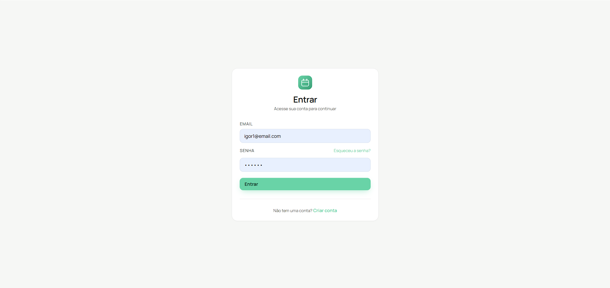
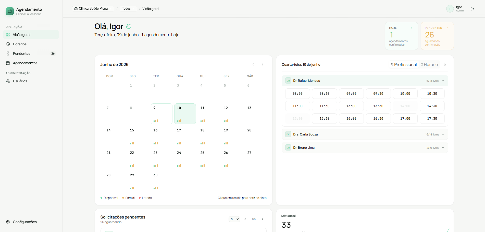
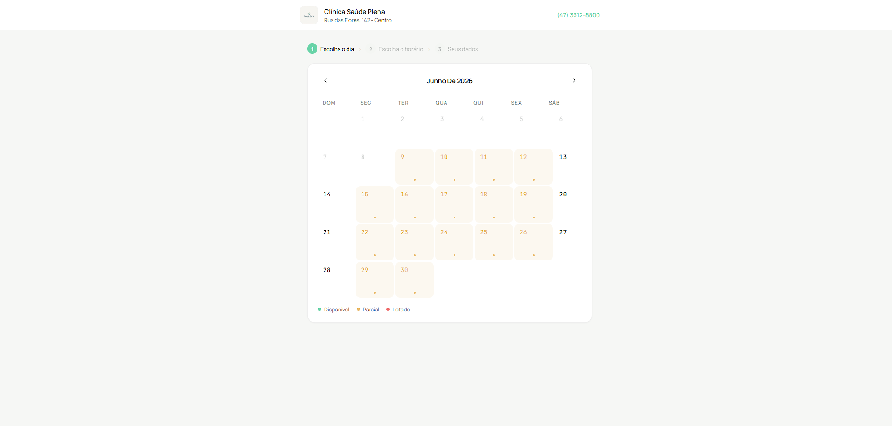
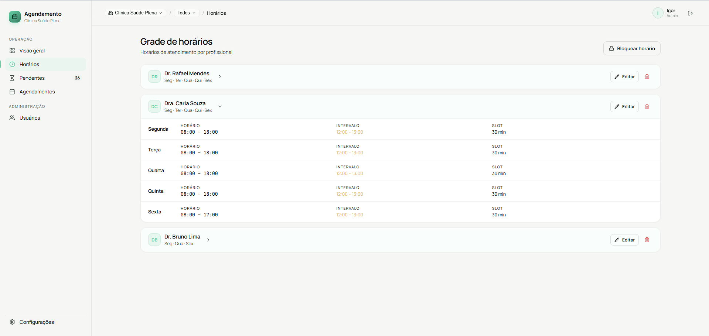
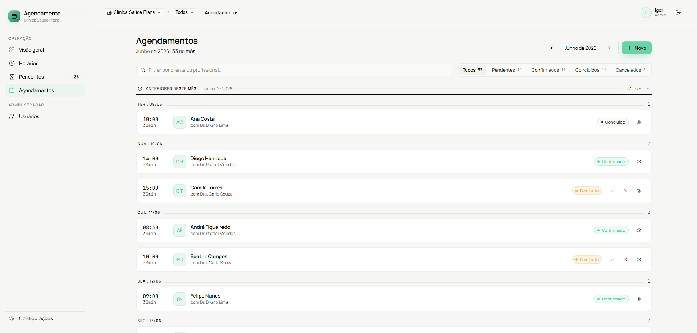
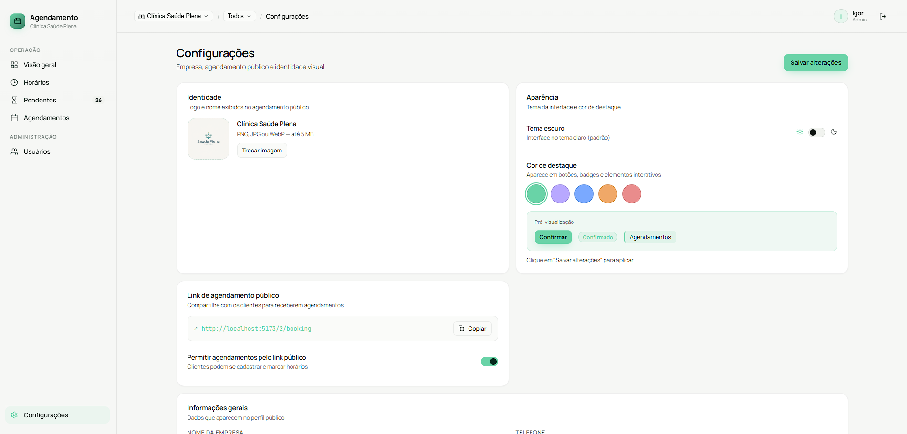
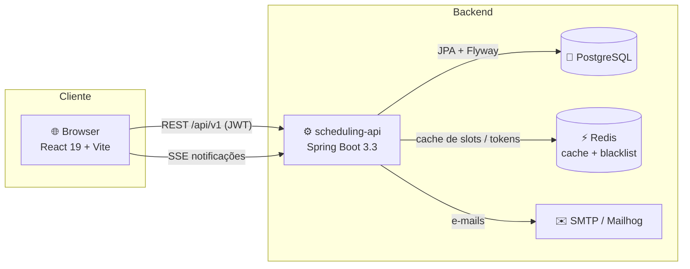
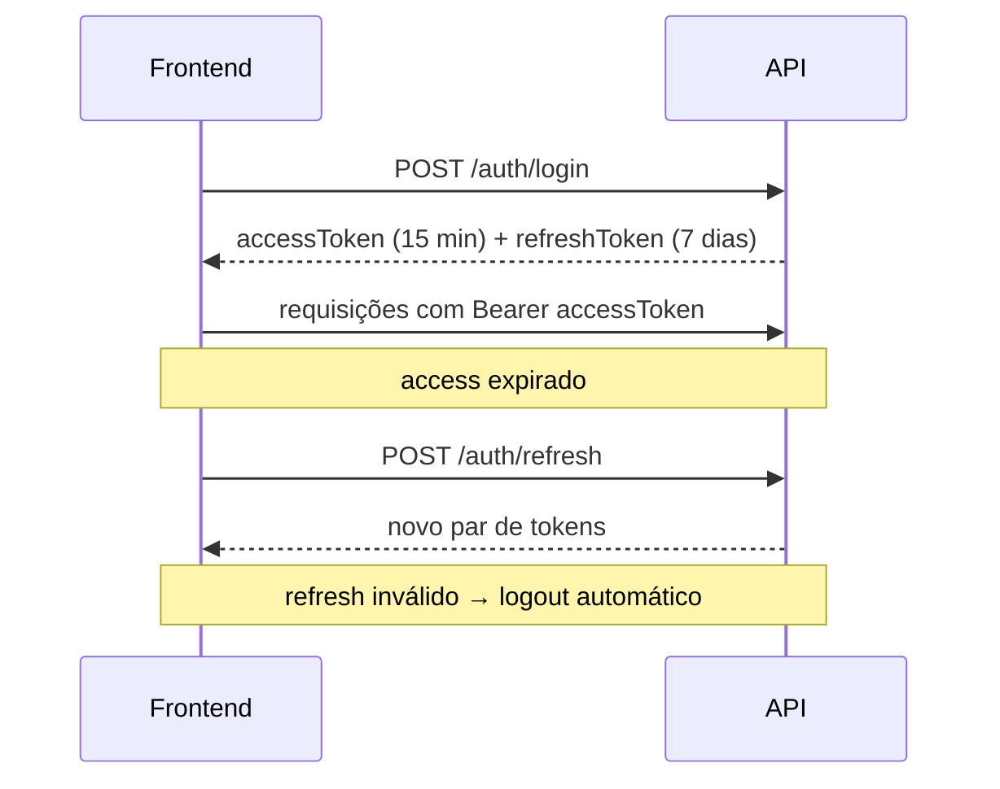
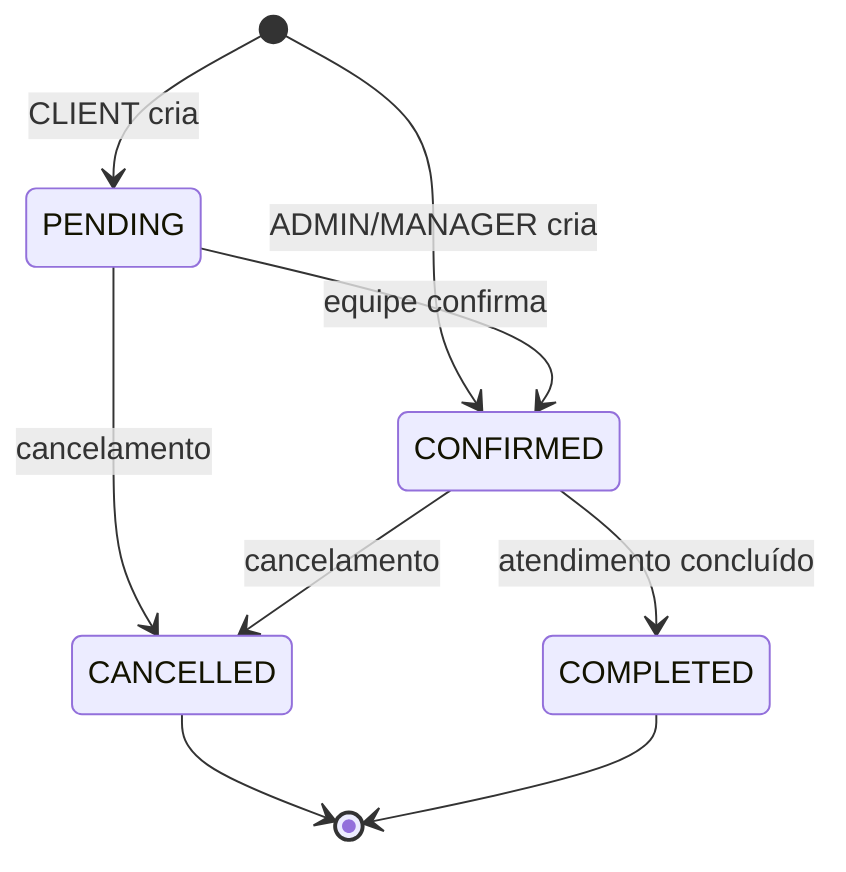

<div align="center">

# 📅 Scheduling

### Plataforma de agendamento multi-tenant para clínicas e prestadores de serviço

Sistema completo de marcação de horários com painel administrativo, agenda por profissional,
agendamento público sem cadastro e notificações em tempo real.

<br>


</div>

---

## 📑 Índice

- [Sobre o projeto](#-sobre-o-projeto)
- [Funcionalidades](#-funcionalidades)
- [Screenshots](#-screenshots)
- [Arquitetura](#-arquitetura)
- [Stack tecnológica](#-stack-tecnológica)
- [Estrutura do repositório](#-estrutura-do-repositório)
- [Como rodar](#-como-rodar)
- [Variáveis de ambiente](#-variáveis-de-ambiente)
- [Fluxos principais](#-fluxos-principais)
- [Testes](#-testes)
- [Documentação](#-documentação)
- [Convenção de branches](#-convenção-de-branches)

---

## 🎯 Sobre o projeto

O **Scheduling** é um sistema de agendamento **multi-tenant** (várias empresas na mesma
instância) pensado para clínicas, consultórios e prestadores de serviço que precisam
organizar horários, profissionais e clientes em um só lugar.

A proposta é cobrir o ciclo completo do agendamento:

- A **empresa** configura suas grades de horário, profissionais e regras.
- O **cliente** marca um horário — autenticado pelo painel ou de forma **pública**, sem precisar criar conta antes.
- A **equipe** confirma, remarca, cancela e acompanha tudo por um dashboard com métricas em tempo real.

O sistema é organizado em torno de **quatro papéis** com permissões distintas:

| Papel | Responsabilidade |
|---|---|
| 🛡️ **ADMIN** | Acesso total. Cria empresas, gerencia usuários e gestores. |
| 🏢 **MANAGER** | Administra a própria empresa: agendas, agendamentos e configurações. Pode também atender. |
| 👩‍⚕️ **PROFESSIONAL** | Visualiza e gerencia a própria agenda de atendimentos. |
| 🙋 **CLIENT** | Marca e acompanha seus próprios agendamentos. Não fica preso a uma empresa. |

---

## ✨ Funcionalidades

### Autenticação & segurança
- Login com **JWT** (access token de 15 min + refresh token de 7 dias).
- **Refresh automático** transparente via interceptor — sem deslogar o usuário no meio da sessão.
- Logout com **revogação** dos refresh tokens e blacklist de access tokens (Redis).
- Recuperação de senha (esqueci minha senha / reset por token).
- **Rate limiting** nas rotas sensíveis.

### Painel administrativo (ADMIN / MANAGER)
- **Visão geral** com cards de métricas (agendamentos do dia, pendentes, total do mês, taxa de confirmação), calendário e fila de pendentes.
- **Grades de horário**: CRUD por dia da semana, slots de 15/30/45/60/90/120 min, intervalo de almoço e **bloqueios temporários**.
- **Agendamentos**: listagem por mês, filtros por status, busca por cliente/profissional e ações de confirmar/cancelar.
- **Pendentes**: fila dedicada para aprovar ou recusar solicitações.
- **Usuários** (ADMIN): criação de gestores e vínculo de usuários a empresas.
- **Configurações da empresa**: logo, dados gerais, toggle de agendamento público e status ativo/inativo.

### Agendamento público
- Página de booking acessível por link (`/{empresa}/booking`) **sem necessidade de login**.
- Fluxo multi-step: escolher dia → escolher horário → preencher dados → confirmação.
- Criação **automática** de conta de cliente quando o e-mail ainda não existe.

### Área do cliente
- Lista dos próprios agendamentos com destaque para o próximo.
- Cancelamento de horários futuros.
- Escolha da clínica entre as que permitem agendamento público.

### Tempo real
- **Notificações via SSE** (Server-Sent Events) para atualizações instantâneas no painel.

---

## 📸 Screenshots

> As imagens abaixo ficam em [`docs/screenshots/`](docs/screenshots). Substitua os arquivos
> pelos prints reais da aplicação mantendo os mesmos nomes para que apareçam aqui.

<div align="center">

| Login | Dashboard |
|:---:|:---:|
|  |  |
| **Agendamento público** | **Grades de horário** |
|  |  |
| **Lista de agendamentos** | **Configurações da empresa** |
|  |  |

</div>

---

## 🏗 Arquitetura

Monorepo com três frentes: **API** (Java/Spring), **frontend** (React) e **infra/docs**.



**Decisões de destaque**
- Sessão **stateless**: JWT curto + refresh em banco com revogação explícita.
- Schema 100% gerido por **Flyway** (`ddl-auto: validate`); Hibernate apenas valida.
- Documentação **OpenAPI** isolada do controller (interfaces `*ControllerDoc`).
- Cache de slots disponíveis no **Redis** (TTL 2 min) e blacklist de tokens no logout.
- Multi-tenancy por empresa: rotas de painel sob `/:companyId/`.

---

## 🧰 Stack tecnológica

### Backend — `scheduling-api`
| Camada | Tecnologia |
|---|---|
| Runtime | Java 21 |
| Framework | Spring Boot 3.3 |
| Persistência | Spring Data JPA + Hibernate |
| Banco | PostgreSQL 16 |
| Migrações | Flyway |
| Autenticação | Spring Security + JWT (jjwt) |
| Cache / Sessão | Redis |
| Mapeamento | Lombok + MapStruct |
| Docs | SpringDoc OpenAPI / Swagger UI |
| Testes | JUnit 5 + Testcontainers |
| Build | Maven |

### Frontend — `scheduling-frontend`
| Camada | Tecnologia |
|---|---|
| Framework | React 19 + TypeScript |
| Bundler | Vite 8 |
| Roteamento | React Router DOM 7 |
| Estado global | Zustand 5 (persistido) |
| Dados assíncronos | TanStack React Query 5 |
| Formulários | React Hook Form 7 + Zod 4 |
| HTTP | Axios |
| Estilo | Design system próprio (CSS tokens, tema dark mint) |
| Ícones | lucide-react |
| Testes | Vitest + Testing Library + Cypress (E2E) |

---

## 📂 Estrutura do repositório

```
scheduling/
├── scheduling-api/        # Backend — Java 21 + Spring Boot 3.3 + PostgreSQL (porta 8080)
│   └── src/main/java/com/scheduling/api/
│       ├── appointment/   # Agendamentos e calendário
│       ├── auth/          # Autenticação JWT, refresh, reset de senha
│       ├── company/       # Empresas e configurações
│       ├── scheduling/    # Grades de horário, bloqueios e disponibilidade
│       ├── user/          # Usuários e papéis
│       ├── notification/  # Notificações em tempo real (SSE)
│       ├── config/        # Security, Redis, Swagger, rate limit
│       ├── doc/           # Interfaces OpenAPI (*ControllerDoc)
│       └── exception/     # Tratamento global de erros
│
├── scheduling-frontend/   # Frontend — React 19 + TypeScript + Vite (porta 5173)
│   └── src/
│       ├── api/           # Chamadas HTTP por domínio
│       ├── components/    # Componentes reutilizáveis
│       ├── hooks/         # Hooks (React Query + lógica de domínio)
│       ├── pages/         # Páginas (auth, dashboard, booking, client, setup)
│       ├── router/        # Definição de rotas
│       ├── store/         # Stores Zustand
│       └── types/         # Tipos e enums
│
├── scheduling-infra/      # Documentação de infraestrutura e roadmap (mensageria, observabilidade, CI/CD, IaC)
├── docs/                  # Documentação centralizada do projeto
├── docker-compose.yml     # Orquestração: frontend + backend + postgres + redis + mailhog
└── .env.example           # Template de variáveis de ambiente
```

---

## 🚀 Como rodar

### Opção 1 — Docker Compose (recomendado)

Sobe tudo (frontend, backend, PostgreSQL, Redis e Mailhog) com um comando:

```bash
# 1. Crie o arquivo de ambiente a partir do template
cp .env.example .env      # edite os valores (em especial JWT_SECRET e DB_PASS)

# 2. Suba a stack
docker compose up --build
```

| Serviço | URL |
|---|---|
| Frontend | http://localhost:5173 |
| API | http://localhost:8080 |
| Swagger UI | http://localhost:8080/swagger-ui.html |
| Mailhog (caixa de e-mail de dev) | http://localhost:8025 |

### Opção 2 — Manual (desenvolvimento)

**Backend** (precisa de PostgreSQL e Redis rodando):
```bash
cd scheduling-api
./mvnw spring-boot:run
```

**Frontend:**
```bash
cd scheduling-frontend
npm install
npm run dev
```

---

## 🔐 Variáveis de ambiente

Definidas em `.env` (veja [`.env.example`](.env.example)):

| Variável | Descrição |
|---|---|
| `DB_HOST` / `DB_PORT` / `DB_NAME` / `DB_USER` / `DB_PASS` | Conexão PostgreSQL |
| `REDIS_HOST` / `REDIS_PORT` | Conexão Redis |
| `JWT_SECRET` | Chave base64 para assinatura dos tokens (`openssl rand -base64 48`) |
| `MAIL_HOST` / `MAIL_PORT` / `MAIL_USER` / `MAIL_PASS` | Servidor de e-mail |
| `VITE_API_URL` | Base URL da API consumida pelo frontend |

> ⚠️ Nunca versione o `.env` real — apenas o `.env.example`. Gere um `JWT_SECRET` forte e exclusivo para produção.

---

## 🔄 Fluxos principais

### Autenticação


### Ciclo de vida do agendamento


---

## 🧪 Testes

**Backend** (JUnit + Testcontainers):
```bash
cd scheduling-api
./mvnw test
```

**Frontend** (Vitest unitários + Cypress E2E):
```bash
cd scheduling-frontend
npm test          # unitários
npm run e2e       # end-to-end (Cypress headless)
npm run e2e:open  # Cypress interativo
```

---

## 📚 Documentação

A documentação completa fica em [`docs/`](docs):

| Tema | Arquivo |
|---|---|
| Visão geral, contratos e papéis | [docs/overview.md](docs/overview.md) |
| Arquitetura do backend | [docs/backend/architecture.md](docs/backend/architecture.md) |
| Endpoints da API | [docs/backend/endpoints.md](docs/backend/endpoints.md) |
| Banco de dados | [docs/backend/database.md](docs/backend/database.md) |
| Arquitetura do frontend | [docs/frontend/architecture.md](docs/frontend/architecture.md) |
| Páginas e telas | [docs/frontend/pages.md](docs/frontend/pages.md) |
| Infraestrutura e roadmap | [scheduling-infra/](scheduling-infra) |

---

## 🌿 Convenção de branches

| Branch | Papel |
|---|---|
| `main` | Branch estável. |
| `development` | Branch de integração — todo trabalho é mergeado aqui. |
| `feat/*`, `fix/*`, `chore/*`, `docs/*` | Branches de funcionalidade, criadas a partir de `development`. |

Commits seguem [Conventional Commits](https://www.conventionalcommits.org/) (`feat:`, `fix:`, `chore:`, `docs:`, `refactor:`, `test:`).

---

<div align="center">

Desenvolvido por **[Igor Heck](https://github.com/IgorHeck)** 🚀

</div>
