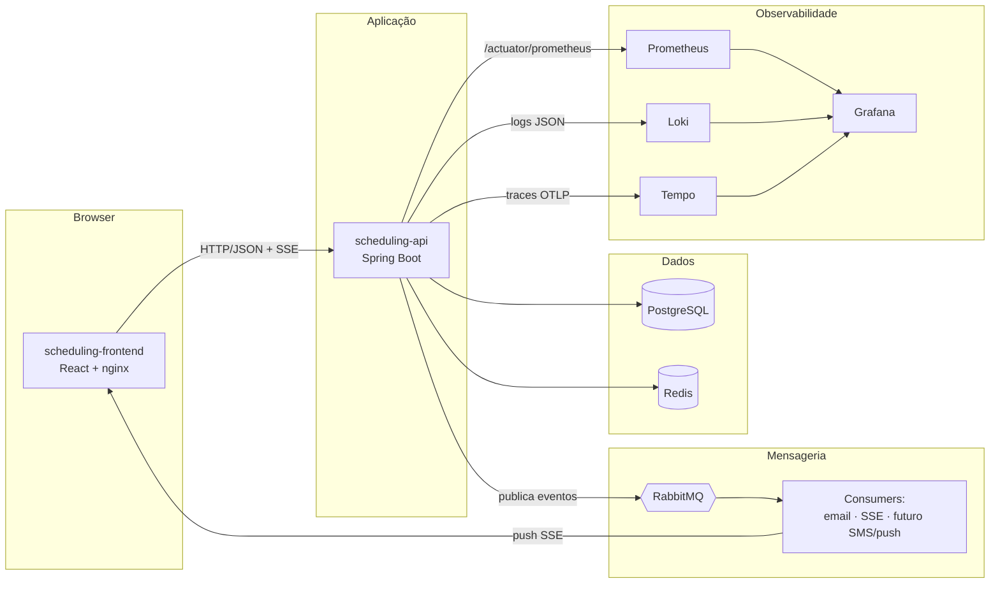

# 00 — Visão geral da infraestrutura

Relacionados: [README](../README.md) · [mensageria](01-mensageria.md) · [observabilidade](02-observabilidade.md) · [segurança](03-seguranca.md) · [ci-cd](04-ci-cd.md) · [orquestração](05-orquestracao.md) · [cloud/iac](06-cloud-iac.md) · [roadmap](07-roadmap.md) · [mapa da vaga](08-mapa-requisitos-vaga.md)

## Contexto

O sistema de agendamento hoje roda **local e em Docker**, com três peças:

- **scheduling-api** — Java 21 + Spring Boot 3.3 + PostgreSQL. Já tem Redis (cache de slots,
  blacklist de token, rate limiting), Spring Mail assíncrono, notificações SSE, Actuator,
  Flyway e uma suíte de testes ampla (unit, slice `@WebMvcTest`, integração com Testcontainers).
- **scheduling-frontend** — React 19 + TypeScript + Vite, servido por nginx; Vitest + Cypress.
- **docker-compose** na raiz — frontend, backend, postgres, redis, mailhog.

O objetivo desta camada é elevar o projeto a um nível de **plataforma**: mensageria,
observabilidade, segurança de pipeline, CI/CD e orquestração — escolhendo só o que faz
sentido para *este* sistema (projeto pessoal/portfólio, não produção real).

## Princípios de decisão

1. **Sem overkill.** Cada tecnologia precisa de um caso de uso real no sistema. Adicionar
   peso sem motivo é sinal negativo num portfólio, não positivo.
2. **Self-hostable e gratuito.** Tudo precisa subir num `docker-compose` local. Nada de
   SaaS pago ou serviço cloud-locked como dependência obrigatória.
3. **Um de cada categoria.** A vaga cita dois brokers (RabbitMQ *e* Kafka), dois stacks de
   observabilidade etc. Escolhemos **um** por categoria, o que melhor encaixa.
4. **Cloud e Kubernetes como demonstração opcional**, não como base — o sistema não vai
   rodar de fato em produção.

## Arquitetura-alvo (alto nível)

## Escopo — o que ENTRA

| Tema | Tecnologia escolhida | Por quê |
|------|----------------------|---------|
| **Mensageria** | **RabbitMQ** (Spring AMQP) | Desacopla os efeitos colaterais do agendamento (e-mail, SSE) do request HTTP, com retry e DLQ. Caso de uso real e simples. Ver [01](01-mensageria.md). |
| **Observabilidade** | **Prometheus + Grafana + Loki + Tempo** + Micrometer/OpenTelemetry | Métricas, logs e tracing num só painel (Grafana). Actuator já existe; falta pouco. Ver [02](02-observabilidade.md). |
| **Segurança de plataforma** | Trivy, OWASP Dependency-Check, gitleaks, security headers, secrets fora do git | Cobre OWASP Top 10 e supply chain. Boa parte do app-level já existe (JWT, BCrypt, rate limit, blacklist). Ver [03](03-seguranca.md). |
| **CI/CD** | **GitHub Actions** | Os repos já estão no GitHub. Build, testes, cobertura, scan e build de imagem. Ver [04](04-ci-cd.md). |
| **Qualidade / análise estática** | JaCoCo, SpotBugs + Find-Sec-Bugs, SonarCloud (opcional) | Reaproveita a suíte de testes que já existe e adiciona gates no CI. Ver [04](04-ci-cd.md). |
| **Orquestração** | Docker Compose (base) + **Kubernetes/Helm** (fase opcional) | Compose para rodar tudo; K8s/Helm como demonstração em kind/minikube. Ver [05](05-orquestracao.md). |

## Escopo — o que NÃO entra (e por quê)

| Item citado na vaga | Decisão | Justificativa |
|---------------------|---------|---------------|
| **Kafka** | ❌ fora | Não há streaming de alto volume, replay/event-sourcing nem múltiplos consumer groups reprocessando histórico. RabbitMQ já cumpre o requisito "mensageria" com menos peso operacional. Documentado como alternativa em [01](01-mensageria.md). |
| **SQS / SNS / JMS** | ❌ fora (citado como equivalente) | SQS/SNS são cloud-locked (AWS) e o sistema não roda na AWS. RabbitMQ demonstra os mesmos conceitos localmente. Mapeamento para SQS/SNS fica em [06](06-cloud-iac.md). |
| **ELK (Elasticsearch)** | ❌ fora | Elasticsearch é pesado para um projeto pessoal. **Loki** entrega agregação de logs no mesmo Grafana com fração do custo. ELK fica documentado como alternativa em [02](02-observabilidade.md). |
| **New Relic / CloudWatch** | ❌ fora | SaaS pago / cloud-locked. A stack Grafana cobre o mesmo localmente e de graça. |
| **Serverless (Lambda, DynamoDB, API Gateway)** | ❌ fora | A aplicação é um monólito Spring Boot stateful (JPA, SSE em memória, sessões de cache). Não há caso de uso que justifique funções efêmeras. Análise em [06](06-cloud-iac.md). |
| **Cloud real provisionada (AWS/Azure/GCP)** | ⚠️ só design | O projeto não vai rodar em produção. Terraform/cloud ficam como diagrama e exemplo ilustrativo, não como infraestrutura aplicada. Ver [06](06-cloud-iac.md). |
| **Liquibase** | ❌ fora | O backend já usa **Flyway** (11 migrações). Liquibase resolveria o mesmo problema — trocar seria retrabalho sem ganho. |
| **Big Data** | ❌ fora | Volume de dados de um agendador é pequeno; não há justificativa. |
| **Docker Swarm / Mesos** | ❌ fora | Se for demonstrar orquestrador, Kubernetes é o padrão de mercado. Um só basta. |

## Como a infra se conecta aos sistemas

- **Maior parte do código novo cai no `scheduling-api`** (publisher/consumers de RabbitMQ,
  exporter Prometheus, tracing, headers de segurança). Cada documento tem uma seção
  **"O que mexer no backend"** com os arquivos exatos.
- **`scheduling-frontend` quase não muda** — ganha um workflow de CI próprio e, opcionalmente,
  coleta de Web Vitals.
- **CI/CD vive em cada repo** (`.github/workflows/`), porque `scheduling-api` e
  `scheduling-frontend` são repositórios GitHub independentes.
- **Stack de plataforma** (RabbitMQ, Prometheus, Grafana, Loki, Tempo) sobe a partir desta
  pasta, via `docker-compose` de infra.

## Pendências de coordenação (a fazer na implementação)

- Adicionar uma linha **infra** na tabela de roteamento do `CLAUDE.md` da raiz do projeto
  (`scheduling/CLAUDE.md`) — hoje ele só mapeia backend/frontend/docs. *(Não alterado ainda,
  conforme pedido de "não fazer mudanças".)*
- Decidir se a stack de infra entra no `docker-compose.yml` da raiz ou num arquivo separado
  em `scheduling-infra/compose/` (recomendação: separado, ver [05](05-orquestracao.md)).
