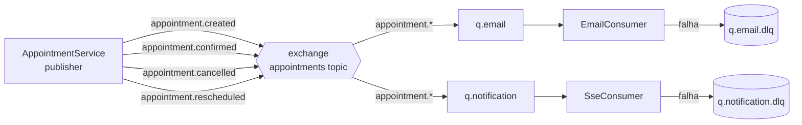

# 01 — Mensageria (RabbitMQ)

Relacionados: [overview](00-overview.md) · [observabilidade](02-observabilidade.md) · [roadmap](07-roadmap.md) · [cloud/iac](06-cloud-iac.md)

## Decisão: RabbitMQ (e só ele)

**Tecnologia escolhida: RabbitMQ + Spring AMQP (`spring-boot-starter-amqp`).**

A vaga cita RabbitMQ *e* Kafka. Escolhemos **apenas RabbitMQ**, porque o caso de uso real
do sistema é uma **fila de trabalho / pub-sub de notificações**, não um log de eventos de
alto volume.

| Critério | RabbitMQ | Kafka |
|----------|----------|-------|
| Caso de uso | Filas de tarefas, roteamento, pub/sub | Stream de eventos, replay, alto throughput |
| Encaixe no sistema | ✅ disparar e-mail/SSE de forma assíncrona | ❌ não há streaming nem replay de histórico |
| Operação | Leve, sobe num container | Mais pesado (KRaft/ZooKeeper, partições, retenção) |
| Retry/DLQ nativo | ✅ simples (dead-letter exchange) | Possível, porém mais trabalhoso |
| Sinal num portfólio | Bom: ferramenta certa pro problema | Ruim se usado sem justificativa (overkill) |

> Kafka entraria se houvesse: ingestão de eventos em larga escala, necessidade de **replay**
> do histórico, múltiplos consumidores independentes reprocessando o mesmo log, ou um
> pipeline de analytics/event-sourcing. Nada disso existe aqui.

## Problema que resolve neste sistema

Hoje, quando um agendamento muda de estado, o `AppointmentService` chama **direto e em
processo** dois efeitos colaterais:

- envio de e-mail (`MailService`, hoje via `@Async`);
- push de notificação em tempo real (`NotificationService` → SSE).

Isso acopla a regra de negócio aos canais de entrega e não tem retry confiável: se o SMTP
cair, a falha é só logada. Com RabbitMQ, o serviço passa a **publicar um evento de domínio**
e os canais viram **consumidores independentes**, com retry e dead-letter.

### Antes

```
AppointmentService.confirm()
   ├── mailService.sendAppointmentConfirmed(...)   (@Async, sem retry real)
   └── notificationService.notifyUser(...)         (SSE em memória)
```

### Depois

```
AppointmentService.confirm()
   └── eventPublisher.publish(AppointmentConfirmed)  ──▶ RabbitMQ (exchange "appointments")
                                                          ├─▶ fila email      → EmailConsumer
                                                          └─▶ fila notif       → SseConsumer
                                                          (falha → retry → DLQ)
```

## Modelo de eventos e topologia

Exchange do tipo **topic**: `appointments` (com routing keys por evento). Cada consumidor
tem a própria fila ligada à exchange, e cada fila tem uma **dead-letter queue (DLQ)**.



| Evento (routing key) | Quando | Consumidores |
|----------------------|--------|--------------|
| `appointment.created` | criação PENDING/CONFIRMED, criação pública | email, notification |
| `appointment.confirmed` | `confirm()` | email, notification |
| `appointment.cancelled` | `cancel()` | email, notification |
| `appointment.rescheduled` | `reschedule()` | email, notification |

> Os eventos espelham as notificações SSE que já existem hoje (`NEW_PENDING`,
> `APPOINTMENT_CONFIRMED`, `APPOINTMENT_CANCELLED`, `APPOINTMENT_RESCHEDULED`).

### Payload do evento (exemplo)

```json
{
  "eventId": "f0c1...-uuid",
  "type": "APPOINTMENT_CONFIRMED",
  "appointmentId": 123,
  "companyId": 7,
  "clientEmail": "cliente@exemplo.com",
  "occurredAt": "2026-06-07T14:30:00Z"
}
```

`eventId` permite **idempotência** no consumidor (descartar duplicado em caso de redelivery).

## Cuidado importante: SSE é stateful

As conexões SSE vivem **em memória, na instância** que atendeu o `subscribe` (pool de
`SseEmitter` no `NotificationService`). Se algum dia o backend escalar para várias
instâncias:

- A fila de notificação deve usar **fanout** (ou cada instância ter a própria fila exclusiva
  ligada à exchange), para que **toda** instância receba o evento e empurre para os clientes
  conectados *nela*.
- E-mail é diferente: deve ser processado **uma única vez** → fila de trabalho compartilhada
  (competing consumers), não fanout.

Isso é um trade-off clássico de entrega (broadcast vs. work-queue) e está documentado aqui
de propósito — é um bom ponto para conversa de entrevista.

## O que mexer no backend (`scheduling-api`)

> Mensageria é **inteiramente backend**. O frontend **não muda** (continua recebendo via SSE).

1. **`pom.xml`** — adicionar `spring-boot-starter-amqp`.
2. **`docker-compose`** (infra) — adicionar serviço `rabbitmq:3-management` (porta 5672 +
   UI 15672).
3. **`application.yml`** — bloco `spring.rabbitmq.*` (host/port/credentials via env), com
   defaults para dev.
4. **Novo pacote `com.scheduling.api.messaging`**:
   - `RabbitConfig` — declara exchange `appointments`, filas `q.email` / `q.notification`,
     bindings e as DLQs.
   - `AppointmentEvent` (record) e enum de tipos.
   - `AppointmentEventPublisher` — `publish(AppointmentEvent)`.
   - `EmailConsumer` — `@RabbitListener(queues = "q.email")` → chama o `MailService` atual.
   - `SseConsumer` — `@RabbitListener(queues = "q.notification")` → chama o
     `NotificationService` atual.
5. **`AppointmentService`** — substituir as chamadas diretas a `MailService`/
   `NotificationService` por `eventPublisher.publish(...)`. (O `MailService` e o
   `NotificationService` continuam existindo; só passam a ser invocados pelos consumers.)
6. **Retry/DLQ** — configurar `spring.rabbitmq.listener.simple.retry.*` e dead-letter
   routing nas filas.
7. **Testes** — `@RabbitListenerTest` / Testcontainers `RabbitMQContainer` para validar
   publish→consume; ajustar os testes atuais de `AppointmentService` (que hoje verificam
   chamadas diretas a mail/notification) para verificar **publicação de evento**.

### Impacto na documentação do vault

- `docs/backend/architecture.md` — adicionar RabbitMQ à stack e o pacote
  `messaging`.
- `docs/backend/progress.md` — registrar a migração de notificações para eventos.
- `docs/overview.md` — atualizar o fluxo (hoje descreve SSE/e-mail síncronos).

## Frontend — ação necessária

**Nenhuma.** A entrega ao browser continua sendo SSE (`GET /notifications/subscribe`). O que
muda é só *quem* dispara o push internamente (um consumer em vez do service direto).

## Observabilidade da mensageria

- RabbitMQ expõe métricas via plugin Prometheus (`rabbitmq_prometheus`) → scrape pelo
  Prometheus → dashboard no Grafana (profundidade de fila, taxa de publish/ack, mensagens em
  DLQ). Ver [02-observabilidade.md](02-observabilidade.md).
- Alerta sugerido: **mensagens acumulando na DLQ** ou **fila crescendo sem consumo**.

## Equivalência em cloud (não implementado)

Se um dia for para AWS: `appointments` exchange ≈ **SNS topic**; filas ≈ **SQS**; DLQ ≈ SQS
redrive policy. O código com Spring AMQP precisaria de adaptador, mas o desenho de eventos é
o mesmo. Ver [06-cloud-iac.md](06-cloud-iac.md).
