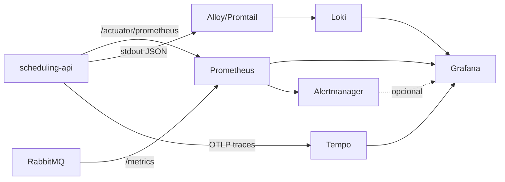

# 02 — Observabilidade

Relacionados: [overview](00-overview.md) · [mensageria](01-mensageria.md) · [ci-cd](04-ci-cd.md) · [orquestração](05-orquestracao.md) · [roadmap](07-roadmap.md)

## Decisão: stack Grafana (Prometheus + Loki + Tempo)

Os três pilares de observabilidade num só painel, todos self-hosted e gratuitos:

| Pilar | Ferramenta | Coletor no app |
|-------|------------|----------------|
| **Métricas** | Prometheus → Grafana | Micrometer + `micrometer-registry-prometheus` (via Actuator) |
| **Logs** | Loki → Grafana | Logback em JSON + Grafana **Alloy** (ou Promtail) |
| **Tracing** | Tempo → Grafana | Micrometer Tracing + OpenTelemetry (OTLP) |

> **Por que não ELK?** Elasticsearch é caro em memória/disco para um projeto pessoal. Loki
> indexa só labels (não o conteúdo todo), roda leve e integra nativamente no Grafana. ELK
> continua sendo o padrão em ambientes grandes — fica como alternativa conhecida, não como
> escolha aqui.
>
> **Por que não New Relic / CloudWatch?** SaaS pago / cloud-locked. A stack Grafana entrega
> o mesmo localmente e de graça.

## Ponto de partida: já existe base

- `spring-boot-starter-actuator` **já está no `pom.xml`**. Falta só expor os endpoints e
  adicionar o registry do Prometheus.
- A aplicação já tem jobs `@Scheduled`, `@Async` e SSE — bons candidatos a métricas de
  negócio.

## Arquitetura



## Métricas (Prometheus + Micrometer)

### O que mexer no backend

1. `pom.xml` — adicionar `io.micrometer:micrometer-registry-prometheus`.
2. `application.yml`:
   ```yaml
   management:
     endpoints:
       web:
         exposure:
           include: health, info, prometheus, metrics
     metrics:
       tags:
         application: scheduling-api
     endpoint:
       health:
         probes:
           enabled: true   # liveness/readiness (útil p/ K8s)
   ```
3. **Métricas de negócio** (custom, via `MeterRegistry`):
   - `appointments_created_total{status=...}`
   - `appointments_cancelled_total`
   - `slot_cache_hit_ratio` (o cache de slots já existe no Redis)
   - profundidade/erros de fila RabbitMQ (já exportadas pelo broker)

### O que já vem de graça

JVM (heap, GC, threads), HTTP (latência e contagem por rota/status), HikariCP (pool de
conexões), cache, e — com o plugin — o próprio RabbitMQ.

### Dashboards Grafana (provisionados como código)

- **JVM/Spring Boot** (dashboard pronto da comunidade, importado por ID).
- **HTTP/API** — p95/p99 por endpoint, taxa de erro 4xx/5xx.
- **Negócio** — agendamentos por status ao longo do tempo, cache hit ratio.
- **RabbitMQ** — publish/ack rate, profundidade de fila, DLQ.

## Logs (Loki)

### O que mexer no backend

1. Logback em **JSON estruturado** (ex.: `logstash-logback-encoder`), incluindo `traceId` e
   `spanId` (correlação com o tracing).
2. Em container, logar em **stdout**; o Alloy/Promtail lê os logs do Docker e envia ao Loki.
3. Sem mudança de código de negócio — é configuração de logging.

Ganho: buscar logs por `traceId` no Grafana e pular direto do trace para os logs daquela
requisição.

## Tracing distribuído (Tempo + OpenTelemetry)

### O que mexer no backend

1. `pom.xml` — `micrometer-tracing-bridge-otel` + `opentelemetry-exporter-otlp`.
2. `application.yml`:
   ```yaml
   management:
     tracing:
       sampling:
         probability: 1.0   # 100% em dev; reduzir em "produção"
     otlp:
       tracing:
         endpoint: http://tempo:4318/v1/traces
   ```
3. **Propagação para o RabbitMQ**: o Spring instrumenta publish/consume, então o trace
   atravessa `HTTP → publish → consumer → e-mail/SSE`. Ótima demonstração de tracing
   ponta a ponta (liga este doc ao [01-mensageria.md](01-mensageria.md)).

## Health checks e probes

`/actuator/health` com probes de **liveness** e **readiness** — já preparados para
Kubernetes (ver [05-orquestracao.md](05-orquestracao.md)). O `docker-compose` pode usar o
health endpoint no `healthcheck` do serviço backend.

## Alertas (opcional)

Regras simples no Prometheus/Grafana:

- erro 5xx acima de X% por 5 min;
- p95 de latência acima de limiar;
- mensagens na DLQ do RabbitMQ;
- backend `DOWN` no health.

Notificação pode ir para e-mail (o MailHog já existe em dev) ou webhook.

## Frontend (opcional)

`web-vitals` (LCP, INP, CLS) enviados a um endpoint do backend → métrica no Prometheus.
Baixa prioridade; entra só se sobrar fôlego.

## Resumo do que mexer onde

| Onde | Mudança |
|------|---------|
| `scheduling-api/pom.xml` | registry Prometheus, micrometer-tracing-otel, otlp exporter, encoder JSON |
| `scheduling-api/application.yml` | expor endpoints actuator, tags, tracing, otlp endpoint |
| `scheduling-api` (código) | métricas de negócio custom via `MeterRegistry` |
| `scheduling-infra/observability/` | configs do Prometheus, Loki, Tempo, Alloy e dashboards Grafana |
| `scheduling-infra/compose/` | serviços prometheus, grafana, loki, tempo, alloy |
| vault | `backend/architecture.md` (stack de observabilidade) |
