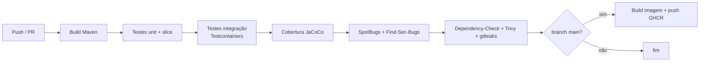

# 04 — CI/CD e qualidade

Relacionados: [overview](00-overview.md) · [segurança](03-seguranca.md) · [observabilidade](02-observabilidade.md) · [orquestração](05-orquestracao.md) · [roadmap](07-roadmap.md)

## Decisão: GitHub Actions

A vaga cita **GitLab-CI**, mas os dois repositórios já estão no GitHub
(`github.com/IgorHeck/scheduling-api` e `.../scheduling-frontend`). Usar **GitHub Actions** é
a escolha natural; os conceitos (stages, jobs, artifacts, cache, registry) são os mesmos do
GitLab-CI. Um `.gitlab-ci.yml` equivalente pode ser adicionado depois como demonstração de
portabilidade, se desejado.

> **Liquibase** (citado na vaga) não entra: o backend já usa **Flyway** para migração de
> banco, que resolve o mesmo problema. O CI apenas **valida** as migrações (sobe um Postgres
> efêmero e roda Flyway), não troca a ferramenta.

## Onde vive

Como são **repos independentes**, cada um tem seu `.github/workflows/`:

```
scheduling-api/.github/workflows/
├── ci.yml                 # build + testes + cobertura + análise estática
├── security.yml           # dependency-check, trivy fs, gitleaks (+ CodeQL opcional)
└── docker-publish.yml     # build da imagem + trivy image + push GHCR (em main/tag)

scheduling-frontend/.github/workflows/
├── ci.yml                 # lint + type-check + vitest + build (+ cypress opcional)
├── security.yml           # npm audit + gitleaks
└── docker-publish.yml     # build + trivy + push GHCR
```

## Pipeline do backend



### Detalhes

- **Build/teste:** `mvn verify`. Cache de `~/.m2` via `actions/cache`.
- **Testcontainers no CI:** funciona direto no runner Ubuntu do GitHub (Docker disponível) —
  resolve a limitação atual de rodar Testcontainers no Docker Desktop do Windows (ver
  `docs/backend/tests.md`). **Ganho real:** os ITs que hoje estão "código pronto,
  não executados" passam a rodar no CI.
- **Cobertura:** JaCoCo gera relatório; publicar como artifact e (opcional) gate mínimo de %.
- **Análise estática:** SpotBugs + Find-Sec-Bugs (segurança no bytecode).
- **Matriz:** Java 21 (single) — sem necessidade de matriz multi-versão.

## Pipeline do frontend

- `npm ci`
- `npm run lint` (ESLint já configurado)
- `tsc -b` (type-check; já faz parte do `build`)
- `npm run test` (Vitest) + cobertura (`@vitest/coverage-v8`, já instalado)
- `npm run build`
- **Cypress (e2e):** opcional no PR (mais lento); pode rodar só em `main` ou agendado.

## Build e publicação de imagem

- Imagens publicadas no **GitHub Container Registry (GHCR)** — gratuito e integrado.
- Tags: `latest` (main) + SHA curto + tag semver quando houver release.
- **Trivy** escaneia a imagem antes do push; build falha em vuln `CRITICAL`.
- Aproveita os **Dockerfiles multi-stage que já existem** nos dois repos.

## Gates de qualidade (resumo)

| Gate | Backend | Frontend |
|------|---------|----------|
| Compila / build | `mvn verify` | `npm run build` |
| Testes | unit + slice + IT | vitest (+ cypress opcional) |
| Cobertura | JaCoCo (artifact, gate opcional) | vitest coverage |
| Lint / estilo | SpotBugs | ESLint |
| Segurança deps | Dependency-Check | npm audit |
| Segredos | gitleaks | gitleaks |
| Imagem | Trivy | Trivy |

## SonarCloud (opcional)

Integração gratuita para repos públicos: cobertura + code smells + security hotspots num
dashboard. Entra como "nice to have" — bom para a vitrine, mas o SpotBugs/ESLint já cobrem o
essencial.

## O que mexer onde

| Onde | Mudança |
|------|---------|
| `scheduling-api/.github/workflows/` | `ci.yml`, `security.yml`, `docker-publish.yml` |
| `scheduling-api/pom.xml` | plugins JaCoCo, SpotBugs+Find-Sec-Bugs, dependency-check |
| `scheduling-frontend/.github/workflows/` | `ci.yml`, `security.yml`, `docker-publish.yml` |
| GitHub repo settings | Actions Secrets (JWT_SECRET de teste, tokens), branch protection exigindo CI verde |
| vault | `backend/tests.md` (ITs agora rodam no CI), `*/progress.md` |
