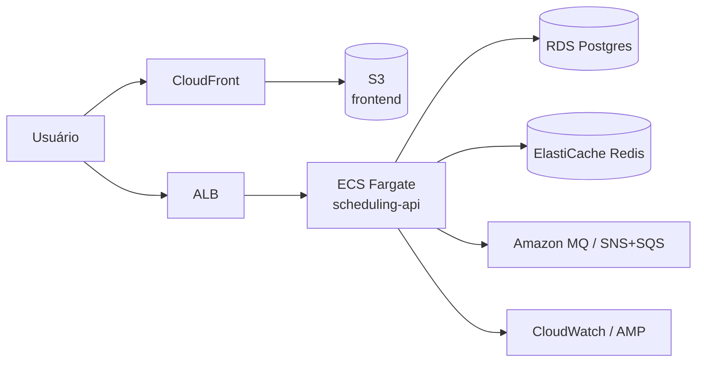

# 06 — Cloud e IaC (ilustrativo / opcional)

Relacionados: [overview](00-overview.md) · [mensageria](01-mensageria.md) · [orquestração](05-orquestracao.md) · [roadmap](07-roadmap.md)

## Premissa

O projeto é pessoal e **não vai rodar de fato em produção numa cloud**. Portanto este
documento é **design e demonstração**, não infraestrutura aplicada. O objetivo é mostrar que
as decisões locais têm um caminho claro para a nuvem — e cobrir os itens "Nuvem Pública",
"Terraform" e "Serverless" da vaga de forma honesta.

## Cloud-alvo de referência: AWS

Escolhida como referência por ser a mais citada na vaga. O desenho abaixo é o **mapeamento**
do que rodamos local para serviços gerenciados:

| Local (este projeto) | Equivalente AWS gerenciado |
|----------------------|----------------------------|
| PostgreSQL (container) | **RDS PostgreSQL** |
| Redis (container) | **ElastiCache for Redis** |
| RabbitMQ (container) | **Amazon MQ (RabbitMQ)** ou **SNS + SQS** |
| Backend container | **ECS Fargate** (ou EKS) |
| Frontend (nginx) | **S3 + CloudFront** |
| Prometheus/Grafana | **Amazon Managed Prometheus/Grafana** ou stack em ECS |
| Imagens Docker | **ECR** (em vez do GHCR usado no CI) |
| Segredos | **Secrets Manager / SSM Parameter Store** |



## Terraform (opcional)

Se a fase for executada, o IaC fica em `scheduling-infra/terraform/`, modularizado:

```
terraform/
├── modules/        # network, rds, ecs, ecr, redis, mq
└── envs/
    └── dev/        # composição dos módulos
```

Boas práticas a demonstrar: state remoto (S3 + DynamoDB lock), variáveis por ambiente,
`plan` no CI antes de `apply` manual, tags de custo.

> **Importante:** rodar isso de verdade gera **custo real na AWS**. A recomendação é manter
> o Terraform como código de demonstração e, se quiser testar, usar **LocalStack** (emulador
> AWS local) para `plan/apply` sem cobrança — mantendo o princípio "tudo roda local e de
> graça".

## Serverless — análise (decisão: NÃO entra)

A vaga cita "Lambda, DynamoDB, API Gateway". **Não encaixa** na arquitetura atual:

- O backend é um **monólito Spring Boot stateful**: JPA com pool de conexões, **SSE em
  memória** (emitters por instância), cache de sessão no Redis. Lambda é efêmera e
  stateless — quebraria o modelo de SSE e sofreria com cold start + esgotamento de conexões
  no banco.
- DynamoDB (NoSQL) substituiria o PostgreSQL relacional, que modela bem as relações do
  domínio (empresas, usuários, grades, agendamentos com FKs e índices). Trocar seria
  reescrever sem ganho.

**Onde serverless *poderia* fazer sentido (futuro, isolado):** uma função pontual disparada
por evento da fila — por exemplo, **gerar um PDF de comprovante** ou **enviar SMS** — sem
tocar no core. Fica registrado como ideia, não como escopo.

## GitLab-CI / outros (equivalências citadas na vaga)

- **GitLab-CI:** os repos estão no GitHub → usamos GitHub Actions ([04](04-ci-cd.md)). Um
  `.gitlab-ci.yml` espelho pode ser adicionado como demonstração de portabilidade.
- **CloudWatch / New Relic:** equivalentes pagos/cloud da stack Grafana ([02](02-observabilidade.md)).
- **SQS/SNS:** equivalentes gerenciados do RabbitMQ ([01](01-mensageria.md)).

## O que mexer onde

| Onde | Mudança |
|------|---------|
| `scheduling-infra/terraform/` | módulos e ambientes (só se a fase opcional for feita) |
| nada no backend/frontend | esta camada é design; código só mudaria num deploy real |
