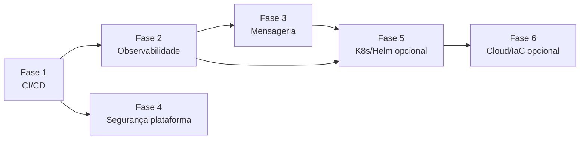

# 07 — Roadmap de implementação

Relacionados: [overview](00-overview.md) · [mensageria](01-mensageria.md) · [observabilidade](02-observabilidade.md) · [segurança](03-seguranca.md) · [ci-cd](04-ci-cd.md) · [orquestração](05-orquestracao.md) · [cloud/iac](06-cloud-iac.md)

Ordem pensada para **entregar valor cedo** e respeitar dependências. Cada fase é
independente e termina com algo demonstrável no portfólio.

## Ordem recomendada

> Por que CI/CD primeiro? É o de **maior retorno e menor risco**: não altera o domínio,
> destrava os testes de integração que hoje não rodam, e cria a rede de segurança para todas
> as fases seguintes.

## Fases

### Fase 1 — CI/CD (base) — **prioridade alta**
- Workflows de build/teste/lint nos dois repos.
- Rodar os ITs Testcontainers no runner (resolve a limitação atual do Windows).
- Build + scan + push de imagem para o GHCR.
- **Resultado:** todo push validado; badge de build verde no README.
- Detalhe: [04-ci-cd.md](04-ci-cd.md). Toca: ambos os repos. Sem mudança de domínio.

### Fase 2 — Observabilidade — **prioridade alta**
- Prometheus + Grafana + Loki + Tempo no compose de infra.
- Exporter Prometheus, logs JSON, tracing OTLP no backend; métricas de negócio.
- Dashboards provisionados.
- **Resultado:** painéis de JVM/HTTP/negócio + tracing ponta a ponta.
- Detalhe: [02-observabilidade.md](02-observabilidade.md). Toca: backend + infra.

### Fase 3 — Mensageria (RabbitMQ) — **prioridade média**
- RabbitMQ no compose; pacote `messaging` no backend; eventos + consumers + DLQ.
- Migrar e-mail e SSE para consumidores de eventos.
- Tracing já cobre publish→consume (sinergia com a Fase 2).
- **Resultado:** efeitos colaterais desacoplados, com retry e DLQ visíveis no Grafana.
- Detalhe: [01-mensageria.md](01-mensageria.md). Toca: **só backend** + infra.

### Fase 4 — Segurança de plataforma — **prioridade média** (paralela à 1)
- Scanners no CI (Dependency-Check, Trivy, gitleaks, npm audit, SpotBugs).
- Security headers; remover defaults de segredo; restringir Actuator.
- **Resultado:** pipeline que barra CVE/segredo; checklist OWASP documentado.
- Detalhe: [03-seguranca.md](03-seguranca.md). Toca: ambos os repos + CI.

### Fase 5 — Kubernetes + Helm — **prioridade baixa (opcional)**
- Manifests + Helm chart; rodar em kind/minikube.
- Probes, ConfigMap/Secret, HPA, kube-prometheus-stack.
- Detalhe: [05-orquestracao.md](05-orquestracao.md). Toca: só infra.

### Fase 6 — Cloud / IaC — **prioridade baixa (opcional/ilustrativo)**
- Terraform modular + diagrama AWS; testar com LocalStack (sem custo).
- Detalhe: [06-cloud-iac.md](06-cloud-iac.md). Toca: só infra.

## Tabela resumo

| Fase | Tema | Prioridade | Sistemas afetados | Muda domínio? |
|------|------|-----------|-------------------|---------------|
| 1 | CI/CD | Alta | api + front | Não |
| 2 | Observabilidade | Alta | api + infra | Não (só instrumenta) |
| 3 | Mensageria | Média | api + infra | Sim (refatora notificações) |
| 4 | Segurança plataforma | Média | api + front + CI | Pouco |
| 5 | K8s/Helm | Baixa (opc.) | infra | Não |
| 6 | Cloud/IaC | Baixa (opc.) | infra | Não |

## Regras ao executar

- Uma fase por vez; cada fase em branch própria com PR (e o CI da Fase 1 validando).
- Mudanças de código no backend/frontend exigem **confirmação antes de aplicar** (repos
  independentes).
- Ao concluir uma fase: atualizar o documento do tema, marcar aqui no roadmap, e atualizar o
  `docs/` (architecture/progress) conforme o caso.
